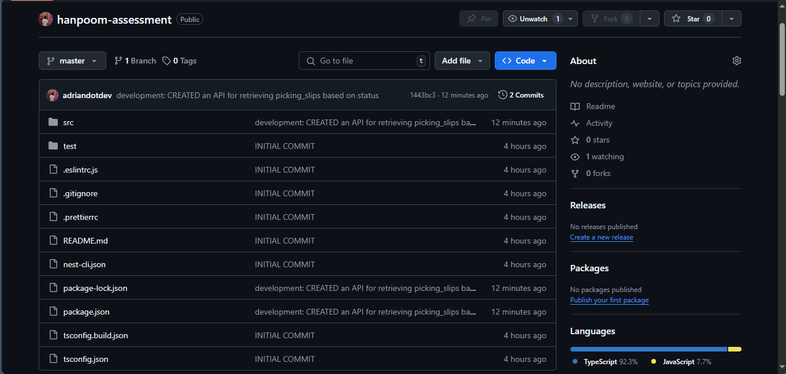
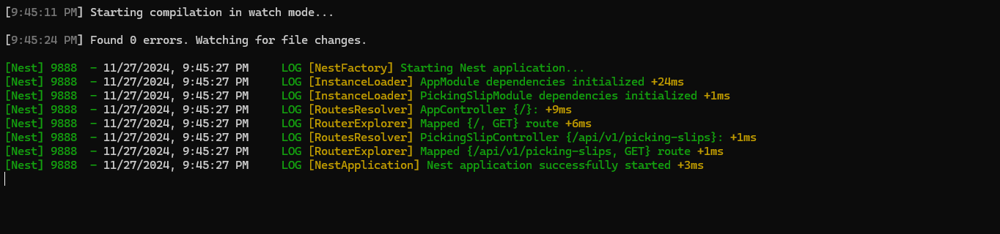

#  Hanpoom  Assessment 

- [ Hanpoom  Assessment](#-hanpoom--assessment)
  - [Prerequisites](#prerequisites)
  - [Database Setup](#database-setup)
    - [Creation of Database, and Tables](#creation-of-database-and-tables)
  - [Insertion of Data](#insertion-of-data)
  - [Running the Project](#running-the-project)
  - [Technologies Used](#technologies-used)
  - [APIs](#apis)
    - [GET Picking Slips](#get-picking-slips)


## Prerequisites
Ensure the following are installed in your local machine:

- Git
- NodeJS
- MySQL
- Any MySQL editor like (SQLYog, MySQL Workbench)

[Back to Top](#hanpoom-assessment)

## Database Setup

Setup the database, tables, and data that we need:

### Creation of Database, and Tables

```sql
CREATE DATABASE hanpoom_database;

USE DATABASE hanpoom_database;

CREATE TABLE picking_slips (
 id BIGINT(20),
 order_id BIGINT(20),
 order_fulfillment_order_id BIGINT(20),
 is_contained_single_product TINYINT(1),
 created_at TIMESTAMP,
 PRIMARY KEY (id)
);
	
CREATE TABLE picking_slip_dates (
 id BIGINT(20),
 picking_slip_id BIGINT(20),
 printed_username VARCHAR(20),
 inspected_username VARCHAR(20),
 packed_username VARCHAR(20),
 shipped_username VARCHAR(20),
 held_username VARCHAR(20),
 cancelled_username VARCHAR(20),
 refunded_username VARCHAR(20),
 confirmed_username VARCHAR(20),
 printed_at TIMESTAMP,
 inspected_at TIMESTAMP,
 packed_at TIMESTAMP,
 shipped_at TIMESTAMP,
 delivered_at TIMESTAMP,
 returned_at TIMESTAMP, 
 cancelled_at TIMESTAMP,
 refunded_at TIMESTAMP,
 held_at TIMESTAMP,
 confirmed_at TIMESTAMP,
 held_reason VARCHAR(20),
 PRIMARY KEY (id),
 FOREIGN KEY (picking_slip_id) REFERENCES picking_slips(id)
);

CREATE TABLE picking_slip_items (
 id BIGINT(20),
 picking_slip_id BIGINT(20),
 item_id BIGINT(20),
 stock_id BIGINT(20),
 order_fulfillment_product_id BIGINT(20),
 quantity INT(11),
 refunded_quantity INT(11),
 location_id BIGINT(20),
 location_code VARCHAR(30),
 is_pre_order TINYINT(1),
 is_sales_only TINYINT(1),
 pre_order_shipping_at TIMESTAMP,
 pre_order_deadline_at TIMESTAMP,
 created_at TIMESTAMP,
 updated_at TIMESTAMP,
 PRIMARY KEY (id),
 FOREIGN KEY (picking_slip_id) REFERENCES picking_slips(id)
);
```

[Back to Top](#hanpoom-assessment)


## Insertion of Data

For this part, we need to insert the provided data from this link: https://drive.google.com/drive/folders/1y6zT4ud7ErmHoxRZA9nprzlHqhKMohvG?usp=sharing

Insert all of the data for each respective tables.

[Back to Top](#hanpoom-assessment)

## Running the Project

1. Open your terminal.

2. Clone this repository: https://github.com/adriandotdev/hanpoom-assessment.git

    

    Run this command:
    ```bash
    git clone https://github.com/adriandotdev/hanpoom-assessment.git
    ```

3. After successfully cloning the repository, navigate to the new created folder:

    ```bash
    cd /hanpoom-assessment
    ```

4. Install the dependencies

    ```bash
    npm run install
    ```

5. Once you successfully setup the database and install the dependencies, run the application.

    ```bash
    npm run start:dev
    ```

    and you will see this in your terminal:
    

[Back to Top](#hanpoom-assessment)

## Technologies Used

- NodeJS
- NestJS
- TypeScript
- MySQL

[Back to Top](#hanpoom-assessment)

## APIs

### GET Picking Slips

**Endpoint**: `/api/v1/picking-slips`

**HTTP Method**: `GET`

**Content-Type**: `application/json`

**API Queries**

- limit - Limit the number of results to be returned. (Default is 10)
- offset - Starting row of the data to be returned (Default is 0)
- status - Picking slip status to filter. (Default is all which returns all the picking slip with status of `held`, `not printed`, and `printed`). Valid values are: `held`, `not printed` and `printed`.

**Sample Response**

```json
{
    "status": 200,
    "data": [
        {
            "order_id": 1463,
            "id": 2878,
            "picking_slip_status": "not printed",
            "has_pre_order_item": "true"
        },
        {
            "order_id": 1462,
            "id": 2877,
            "picking_slip_status": "not printed",
            "has_pre_order_item": "true"
        },
        {
            "order_id": 1461,
            "id": 2873,
            "picking_slip_status": "not printed",
            "has_pre_order_item": "true"
        }
    ],
    "message": "OK"
}
```

> NOTE: This API returns all the data from latest to oldest record based on its `created_at`.

[Back to Top](#hanpoom-assessment)